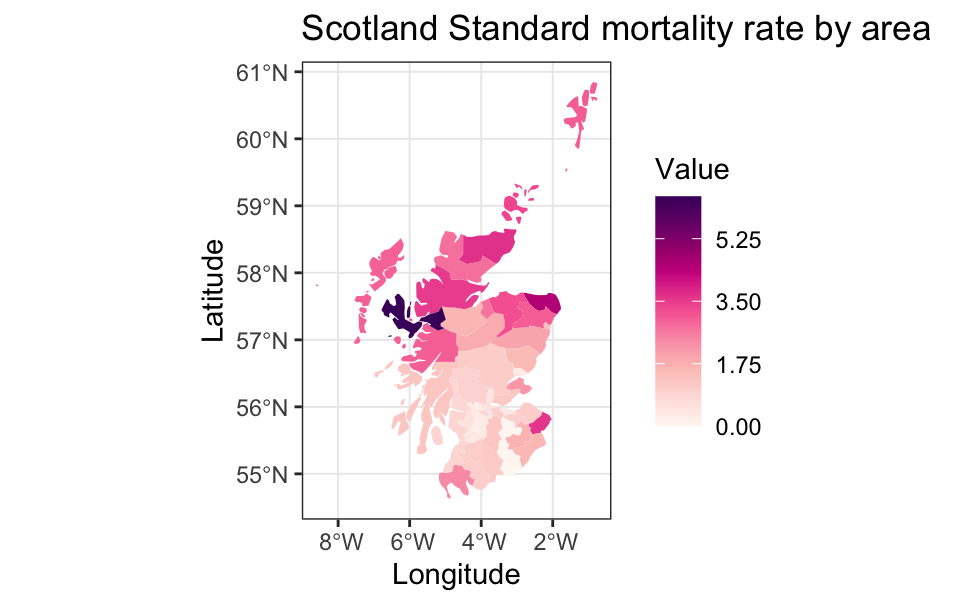
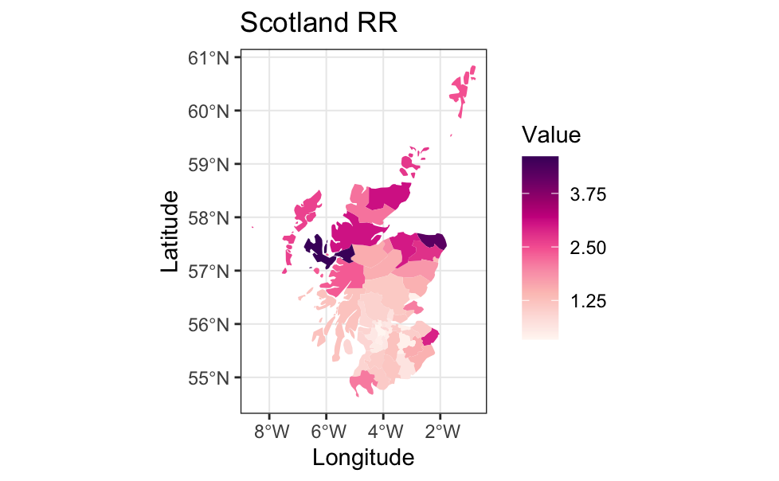
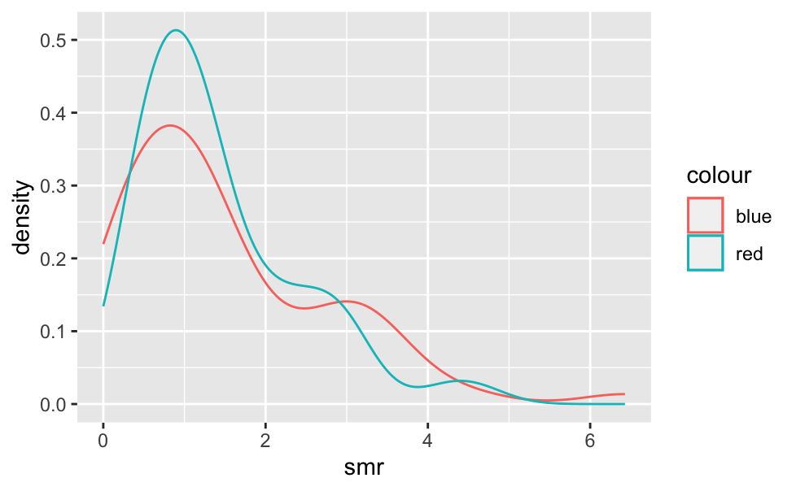
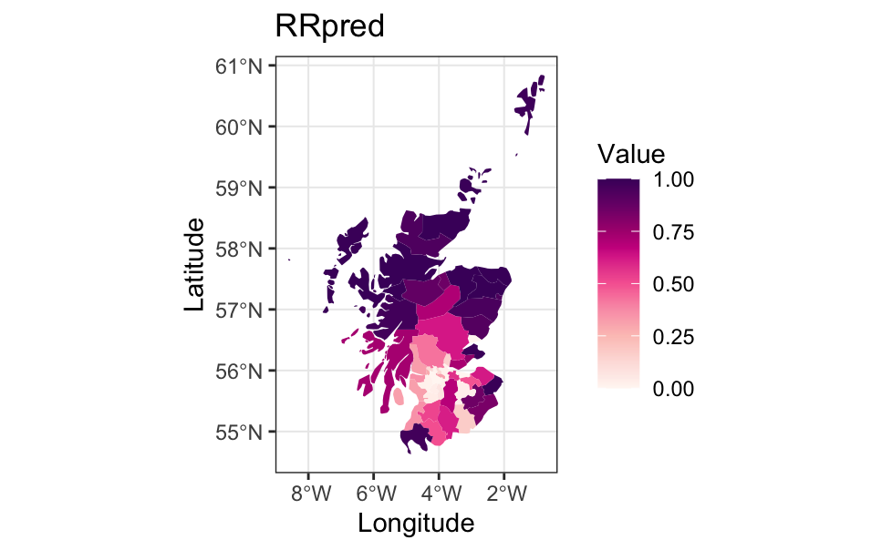
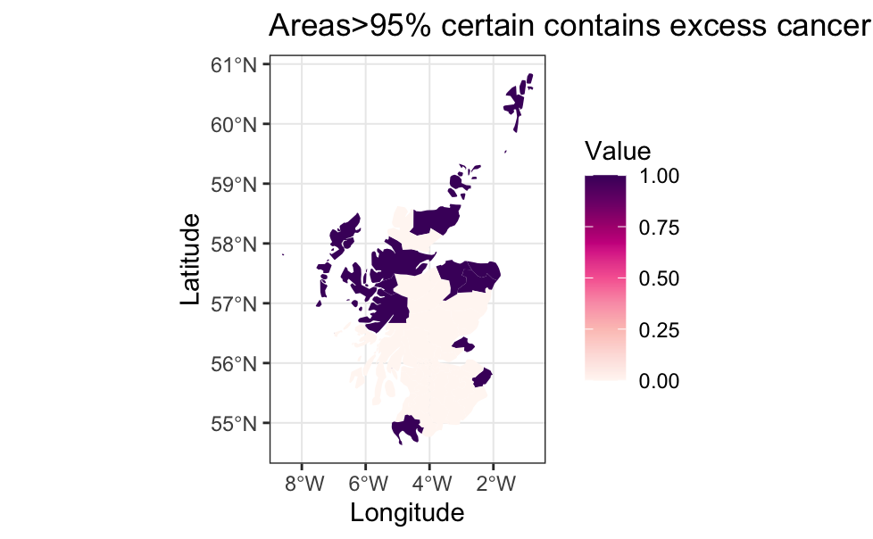
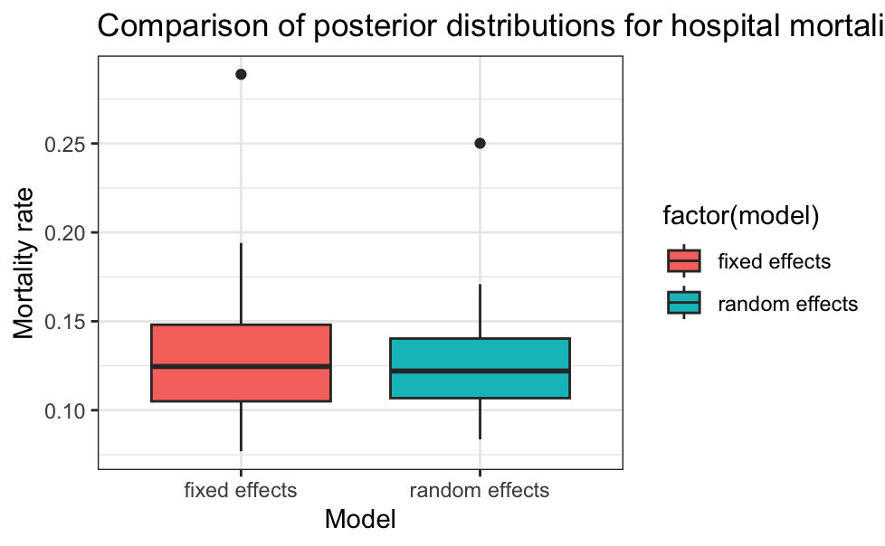

# Bayesian Disease Mapping with Hierarchical Models (JAGS)

## Overview

This project is aimed to showcase how Bayesian modelling can be used to produce more reliable estimates of disease risk when working with a real imperfect dataset. Here I am using mortality data from Scotland, I compare classical Standard Mortality Ratios (SMR) with Bayesian estimates obtained through a hierarchical Poisson model implemented in JAGS.

A recurring issue in real datasets is that estimates can become unstable, especially when working with small populations or low event counts. This project highlights on how Bayesian approaches help address that by stabilizing estimates and accounting for uncertainty.

---

## Goals
 
- Understand how and why naive estimators (SMR) can be unstable
- Estimate regional disease risk using both classical and Bayesian approaches 
- Apply hierarchical Bayesian modelling to improve robustness  
- Quantify uncertainty using posterior probabilities  
- Identify regions with strong evidence of elevated risk  

---

## Methodology

### 1. Classical Approach (SMR)

The Standard Mortality Ratio is defined as:

$$
O_i \sim \text{Poisson}(E_i \cdot \theta_i)
$$

SMR = Observed / Expected

This is a simple and straightforward estimate of relative risk. However, it does not account for variability, especially in regions where the expected number of cases is small.

---

### 2. Bayesian Hierarchical Model

In the next step I use a hierarchical Bayesian model:

$$
O_i \sim \text{Poisson}(E_i \cdot \theta_i)
$$

$$
\log(\theta_i) = \alpha + b_i
$$

$$
b_i \sim \mathcal{N}(0, \sigma^2)
$$

The model was fitted using MCMC sampling in JAGS. This allows estimates of the full posterior distribution of the relative risk rather than relying on a single point estimate.

---

## Results & Interpretation

###  Standard Mortality Ratio (SMR)

The SMR map shows a decent amount variation across regions with some areas appearing to have extreme high risk. Initially, this might suggest strong geographic patterns. However, these values are quite sensitive to small sample sizes and can easily exaggerate small variability, especially in less populated areas.

---

###  Bayesian Relative Risk (Posterior Mean)

After applying the Bayesian model the overall pattern is still visible, but the extreme values are much less pronounced. This is due to the model “borrowing strength” across regions. Instead of treating each area completely independently, it partially pools information leading to more stable and realistic estimates.

---

###  SMR vs Bayesian Estimates

This plot highlights one of the key differences between the two approaches. The SMR distribution is much wider and contains more extreme values, while the Bayesian estimates are more concentrated. This reflects the shrinkage effect of the hierarchical model, where noisy estimates are pulled toward a more reasonable range.

---

###  Posterior Probability of Elevated Risk (P(RR > 1))

Instead of just estimating risk, is it is essential to assess that risk is actually elevated. This map shows the probability that each region has a relative risk greater than 1. Regions with values close to 1 have strong evidence of increased risk, while lower values indicate either low risk or higher uncertainty.

---

###  High-Confidence Risk Regions (>95%)

By applying a threshold of 95%, I highlighted regions where there is strong statistical evidence of elevated risk. Compared to the SMR map, this result is much more conservative, which is often desirable in practice. It avoids flagging regions as high-risk based on noisy or uncertain estimates.

---

## Part-2 Analysis: Surgical Mortality

A secondary analysis was carried out using hospital mortality data. In this instance, I compared fixed-effects and random-effects Bayesian models. The random-effects model shows slightly less variability, reflecting partial pooling across hospitals. This again highlights how hierarchical models can produce more stable estimates when data is limited or uneven.

---

## Key understandings

- Classical estimators like SMR can be misleading when data is scarce  
- Bayesian models help stabilize estimates by incorporating structure  
- Hierarchical modelling reduces extreme values through shrinkage  
- Posterior probabilities provide a clearer interpretation of uncertainty  
- These methods are particularly useful when working with real-world, noisy datasets  

---

## Tools & Libraries

- R  
- JAGS (rjags)  

Libraries used:
- ggplot2  
- dplyr  
- sf  
- coda  
- R2jags

## Code

The full analysis workflow, including model specification and MCMC implementation, is available here:

[Bayesian Disease Mapping (R Markdown)](./Bayesian-project.Rmd)

## Notes

This project was completed as part of postgraduate coursework to further explore bayesian modelling.

